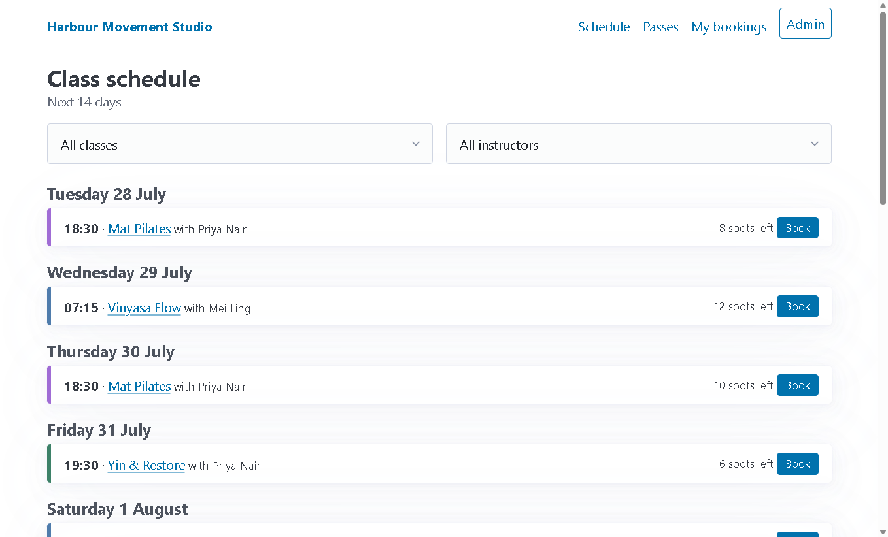
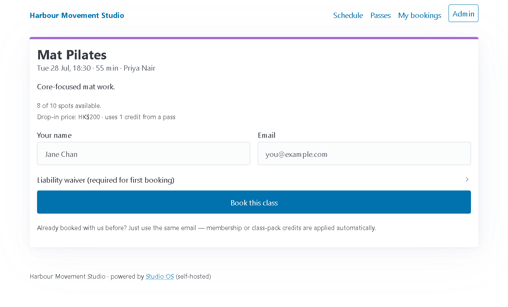
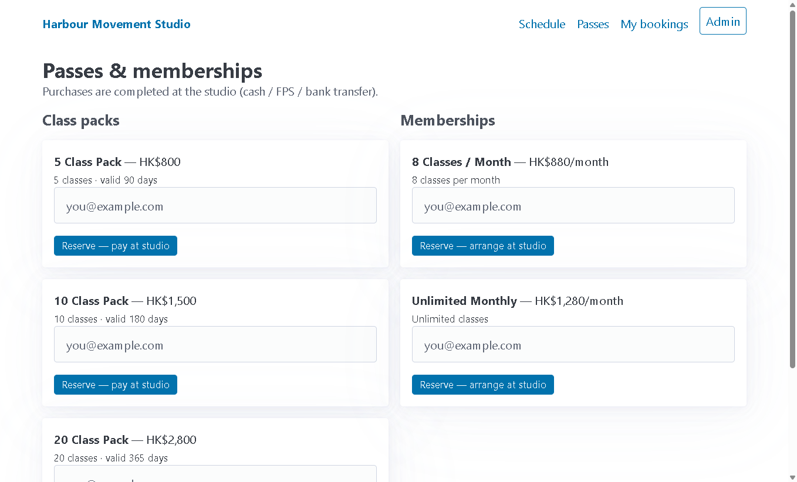
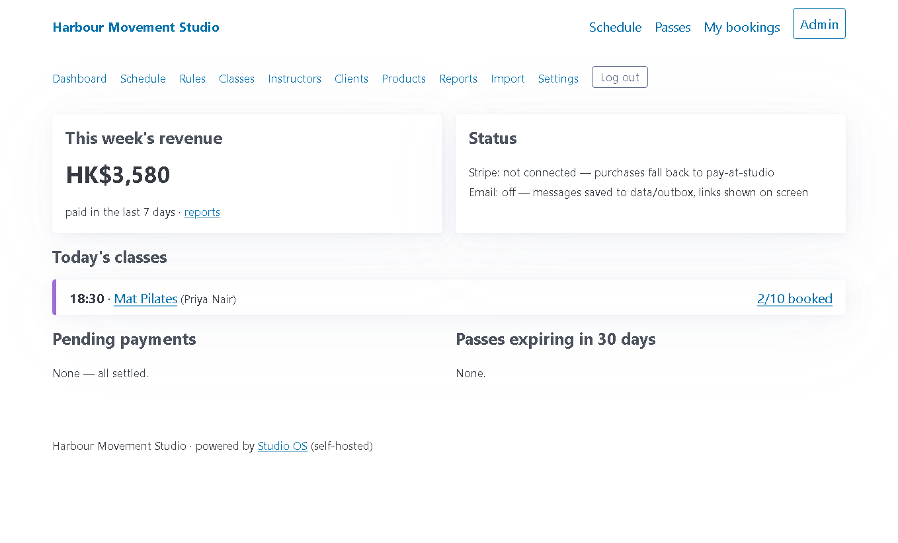
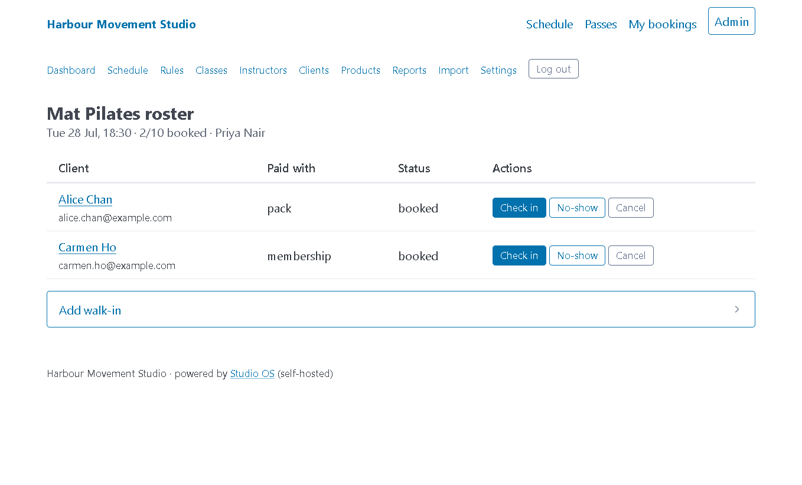
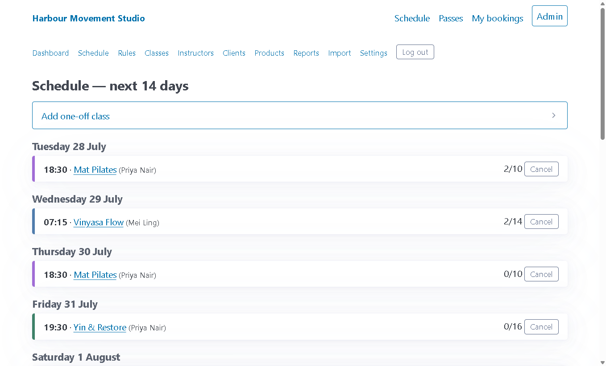
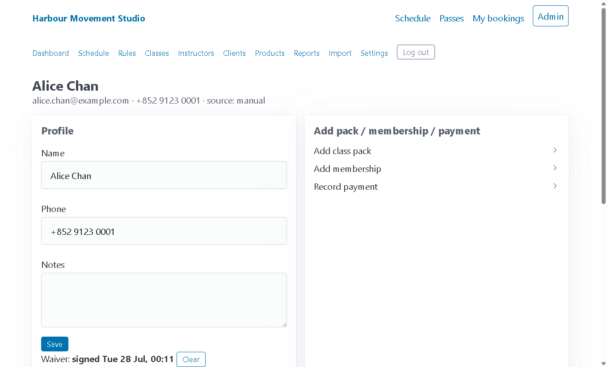
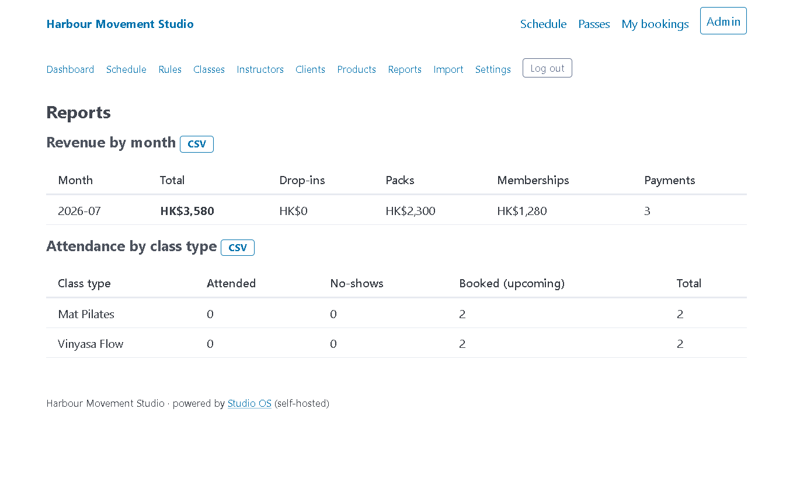

# Studio OS

Self-hosted booking, class-pack and membership management for boutique studios —
yoga, pilates, martial arts, climbing, dance, small gyms. The Mindbody escape hatch.

**The structural difference no SaaS rival can copy:** payments run on *your own*
Stripe account. Studio OS never touches the money — no processing markup, no
per-booking fees, no contracts. Run it in one Docker container or with plain
Node on a $5 VPS or a spare machine at the studio.

- Public schedule + booking with waiver capture — clients need no passwords
  (signed magic links for self-service cancellation)
- Class packs (credits), memberships (unlimited or N/month), drop-ins
- Atomic capacity, FIFO waitlist with auto-promotion, cancellation-window policy
- Admin: rosters + check-in, clients, manual sales, revenue/attendance reports + CSV,
  one-click SQLite backup
- Instructor logins: per-class assignments, a scoped schedule + roster portal
  with attendee check-in, zero admin access
- Mindbody CSV importer (clients + pricing options), idempotent and dry-runnable
- Stripe Checkout for packs and membership subscriptions (optional), SMTP email
  (optional — without it, emails land in `data/outbox/` and links show on screen)
- Everything server-rendered (EJS + HTMX + Pico.css, all vendored — no CDN, no
  build step, works offline), SQLite in one file, PWA manifest + service worker

## 5-minute quickstart

### Docker

```sh
git clone <this repo> studio-os && cd studio-os
docker compose up -d
# open http://localhost:3000 → setup wizard creates your studio + owner login
```

The database persists in the `studio-data` volume. Configure SMTP/Stripe by
uncommenting the `environment:` block in `docker-compose.yml`.

Verified end-to-end (Docker Engine 28.x, linux/amd64, `node:22-slim` base —
better-sqlite3 uses its prebuilt glibc binary, no compiler stage needed):

```sh
docker compose build
docker compose up -d
curl -i http://localhost:3000/   # 302 → /setup on a fresh volume
# setup wizard → admin one-off class → public schedule → guest booking: all OK
docker compose down -v           # stop + remove the data volume
```

### Bare Node (Node 20+)

```sh
git clone <this repo> studio-os && cd studio-os
npm install
npm start
# open http://localhost:3000 → setup wizard
```

The database is a single file at `data/studio.db` (override with `DB_PATH`).
Copy `.env.example` to `.env` to configure port, SMTP, Stripe. Nothing is
required — with zero config the app runs fully offline.

Want to look around with data first?

```sh
npm run seed   # demo studio: classes, weekly schedule, clients, passes
npm start      # admin login: owner@example.com / studio-demo
```

### First-run walkthrough

1. Setup wizard: studio name, timezone, currency, owner account.
2. Admin → Class types: create your classes (duration, capacity, drop-in price, credits).
3. Admin → Schedule: add weekly rules — instances materialize on a rolling
   8-week horizon automatically (at boot, daily, and on rule changes).
4. Share the public schedule (`/`). Clients book with just name + email and sign
   the waiver on first booking.
5. Sell packs/memberships from a client's profile (manual), or connect Stripe
   for online purchase.
6. Optional: Admin → Instructors → "Add instructor login", then tick the
   classes they teach. Instructors sign in on the same staff login page and get
   a portal with just their schedule and rosters (with check-in) — no admin
   access.

## Migrating from Mindbody

You need two CSV exports from Mindbody:

1. **Clients** — Reports → Clients (or Clients → Export). Standard columns:
   `First Name, Last Name, Email, Mobile Phone, Notes, Liability Waiver, ...`
2. **Pricing options** (remaining passes) — Reports → Pricing Options /
   "Remaining sessions". Standard columns:
   `Client, Email, Pricing Option, Remaining, Total, Expiration, Price Paid, ...`

Then either paste the CSVs into **Admin → Import** (dry-run checkbox included),
or run the CLI:

```sh
# preview first — prints every row's action, writes nothing
node scripts/import-mindbody.mjs --clients clients.csv --passes pricing.csv --dry-run

# real import
node scripts/import-mindbody.mjs --clients clients.csv --passes pricing.csv
```

Behavior:

- **Idempotent by email** — re-running updates existing clients/passes, never
  duplicates. Safe to re-export from Mindbody and re-import on cutover day.
- Rows without a valid email are skipped and reported (Mindbody allows
  email-less clients; Studio OS keys everything on email).
- Passes for emails not in the clients file auto-create a bare client record.
- A signed "Liability Waiver = Yes" column marks the waiver as signed so
  clients aren't re-prompted.
- Non-standard column names? Pass `--mapping mapping.json`:

```json
{
  "clients": { "email": ["E-Mail-Adresse"], "firstName": ["Vorname"] },
  "passes": { "remaining": ["Sessions Left"] }
}
```

Keys you provide override the defaults; everything else keeps sane defaults
(see `DEFAULT_MAPPING` in `src/services/importer.js`). Dates accept `M/D/YYYY`
and ISO; money accepts `$1,500.00`-style strings.

## Stripe setup (optional, bring-your-own account)

Without Stripe, every purchase flow falls back to "pay at studio / FPS" and you
activate purchases manually from the client profile — fully usable cash-only.

1. Create a [Stripe](https://stripe.com) account (test mode is fine to start).
2. Set env vars (`.env` or compose environment):
   - `STRIPE_SECRET_KEY` — Developers → API keys
   - `STRIPE_PUBLISHABLE_KEY`
   - `STRIPE_WEBHOOK_SECRET` — see step 3
3. Add a webhook endpoint in Stripe: `https://your-domain/webhooks/stripe`,
   events `checkout.session.completed` and `customer.subscription.deleted`.
   Copy the signing secret into `STRIPE_WEBHOOK_SECRET`.
   (Local testing: `stripe listen --forward-to localhost:3000/webhooks/stripe`.)
4. **Class packs** sell immediately via Checkout (price taken from the product;
   optionally paste a Stripe Price ID on the product for Stripe-side pricing).
5. **Memberships** are Stripe subscriptions: create a recurring Price in Stripe,
   paste its `price_...` id into the plan in Admin → Products.

Fulfillment is idempotent (keyed on the Checkout session id) — Stripe's webhook
retries can't double-credit. Card data never touches your server; clients pay on
Stripe-hosted Checkout. Set `BASE_URL` so success/cancel redirects and emailed
links use your public domain.

## Email (optional)

Set `SMTP_HOST` (+ `SMTP_PORT`/`SMTP_USER`/`SMTP_PASS`/`SMTP_FROM`) to send
booking confirmations, cancellation notices, waitlist promotions and magic
links. Without SMTP, every email is written to `data/outbox/` as a `.eml` file
and magic links are shown directly in the UI — everything remains testable.

## Security

What's protected out of the box:

- **CSRF**: every state-changing form carries a session-bound token; POSTs
  without a valid token get a 403. The Stripe webhook is exempt — it is
  authenticated by Stripe's signature over the raw body instead.
- **Rate limiting** (in-memory fixed window, per IP + route): magic-link
  requests 5/15 min, admin login 10/15 min, public booking/buy POSTs
  30/15 min. Over the limit → friendly 429. Behind a reverse proxy, set
  `TRUST_PROXY=1` so limits key on the first `X-Forwarded-For` hop; without
  it that header is ignored (it's spoofable).
- Passwords are bcrypt-hashed; client self-service uses expiring HMAC-signed
  magic links (no client passwords); sessions are signed `SameSite=Lax`
  `HttpOnly` cookies; webhook fulfillment is idempotent.

What's *not* there yet — plan accordingly:

- **No 2FA** on staff logins.
- The rate limiter is **single-instance and in-memory**: counters are
  per-process and reset on restart. Fine for the one-container target; a
  multi-instance deployment needs a shared store (or limit at the proxy).
- **HTTPS is your reverse proxy's job** — run behind Caddy/Traefik/nginx.

## Backups

Admin → Settings → **Download backup** produces a consistent snapshot via
SQLite `VACUUM INTO`. Or just copy `data/studio.db` while the app is stopped.
It's one file — cron it anywhere.

## Screenshots

**Public booking site** — what your clients see. No account needed; the waiver is
collected on first booking, and returning clients are matched by email so membership
or pack credits apply automatically.

| Schedule | Booking a class |
|---|---|
|  |  |

**Buy page** — class packs and memberships, on *your* Stripe account (or pay-at-studio
if you haven't connected Stripe).



**Admin** — dashboard, schedule, class roster with one-tap check-in, client profiles,
and revenue reports.

| Dashboard | Roster & check-in |
|---|---|
|  |  |

| Schedule management | Client profile | Reports |
|---|---|---|
|  |  |  |

## Development

```sh
npm install
npm test        # node:test + supertest, no network
npm run dev     # --watch mode
```

Stack: Node 20+, Express, better-sqlite3 (WAL), EJS + HTMX + Pico.css
(vendored). No frontend build. Tests cover the booking engine (capacity races,
waitlist FIFO, credit deduct/refund, late-cancel policy), schedule
materialization across timezones, the web flows, importer idempotency, and
Stripe webhook fulfillment against a mock client.

## Honest v0.1 limitations

- **Single studio, single location, one timezone.**
- See [Security](#security) for what is and isn't covered (no 2FA;
  single-instance in-memory rate limiter; HTTPS via your reverse proxy).
- Membership renewal bookkeeping is driven by Stripe webhooks; cash memberships
  need manual renewal (mark paid each cycle).
- Monthly-credit memberships reset on a simple cycle from `cycle_started_on`;
  no proration.
- Emails are plain text; no branded HTML templates yet.
- English UI only (currency is a setting — no hardcoded symbols).
- Reports are month-granularity tables + CSV; no charts.

## Roadmap

- Multi-location support
- Branded/installable PWA per studio (custom colors, icon, name)
- SMS reminders (Twilio-compatible, bring-your-own account)
- Recurring cash membership invoicing + renewal reminders
- Retail/POS, gift cards, video — explicitly out of scope for now, as are staff
  payroll, per-instructor payouts, marketing automation, native apps, GDPR
  export tooling and i18n.

## License

MIT
